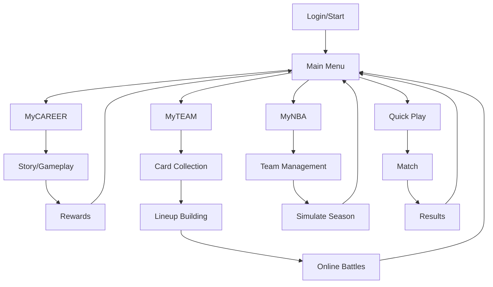

## 1. Product Overview
NBA2K26风格的网页篮球游戏，还原真实NBA比赛体验，包含四大核心游玩模式：MyCAREER辉煌生涯、MyTEAM梦幻球队、MyNBA王朝模式和快速比赛。采用次世代画面表现，主打技术流操作体验。

## 2. Core Features

### 2.1 User Roles
| Role | Registration Method | Core Permissions |
|------|---------------------|------------------|
| Player | Email registration | Access all game modes, customization |
| Guest | No registration | Quick play only |

### 2.2 Feature Module
1. **主菜单**: 游戏模式选择、新闻动态、设置
2. **MyCAREER**: 生涯剧情、球员养成、城市探索、街头对战
3. **MyTEAM**: 卡牌收集、阵容组建、对战模式、拍卖行
4. **MyNBA**: 球队管理、选秀交易、赛季模拟、战术板
5. **快速比赛**: 本地对战、在线匹配、球队选择

### 2.3 Page Details
| Page Name | Module Name | Feature description |
|-----------|-------------|---------------------|
| Main Menu | Hero section | Animated banner, game mode cards, news feed |
| Main Menu | Navigation | Quick access to all modes, settings, profile |
| MyCAREER | Story Mode | Interactive story with dialogue choices |
| MyCAREER | Player Builder | Customize appearance, attributes, skills |
| MyCAREER | City Hub | Explore The City, access venues |
| MyCAREER | Gameplay | Action basketball gameplay |
| MyTEAM | Collection | Browse and manage player cards |
| MyTEAM | Lineup | Build and optimize team lineup |
| MyTEAM | Auctions | Buy/sell cards on marketplace |
| MyNBA | Dashboard | Team overview, finances, standings |
| MyNBA | Roster | Manage players, make trades |
| MyNBA | Draft | Custom draft classes and selections |
| Quick Play | Team Select | Choose teams for local/online play |
| Quick Play | Game | Real-time basketball action |

## 3. Core Process
用户登录 → 选择游戏模式 → 进行游戏/管理 → 获得奖励 → 继续/返回主菜单

## 4. User Interface Design

### 4.1 Design Style
- **Primary colors**: Deep navy (#0A1628), vibrant orange (#FF6B35), metallic silver (#C0C0C0)
- **Secondary colors**: Electric blue (#00D4FF), gold (#FFD700), crimson (#DC143C)
- **Button style**: Bold rounded corners, gradient fills, subtle glow effects
- **Font**: Modern sans-serif with athletic feel - "Rajdhani" for headers, "Inter" for body
- **Layout**: Immersive dark theme with neon accents, card-based navigation
- **Icon style**: Sharp, modern sports icons with dynamic angles

### 4.2 Page Design Overview
| Page Name | Module Name | UI Elements |
|-----------|-------------|-------------|
| Main Menu | Hero section | Full-screen animated background, floating mode cards, parallax effects |
| Main Menu | Navigation | Horizontal carousel of game modes, quick-access buttons |
| MyCAREER | Player Builder | 3D character preview, attribute sliders, skill tree visualization |
| MyCAREER | City Hub | Mini-map, activity markers, character avatar |
| MyTEAM | Collection | Grid layout cards with rarity indicators, filter options |
| MyTEAM | Lineup | Basketball court layout with player positions |
| MyNBA | Dashboard | Financial charts, team stats, standings table |
| Quick Play | Team Select | Team logos grid, conference filter, recent teams |

### 4.3 Responsiveness
- Desktop-first design with 1080p+ resolution support
- Tablet adaptive layout with simplified navigation
- Mobile touch-optimized controls for gameplay

### 4.4 3D Scene Guidance
- **Environment**: NBA arena with dynamic crowd, realistic lighting
- **Lighting**: Dynamic spotlights, arena ambient, player shadows
- **Camera**: Follow cam for gameplay, cinematic angles for cutscenes
- **Composition**: Action-focused with depth of field effects
- **Interactions**: Player animations, ball physics, collision detection
- **Post-processing**: Bloom, motion blur, color grading