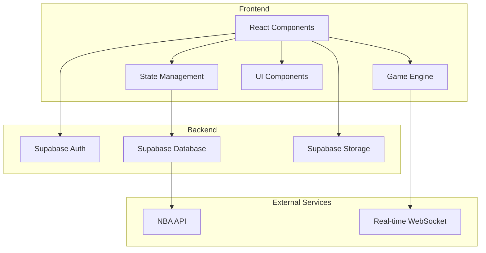
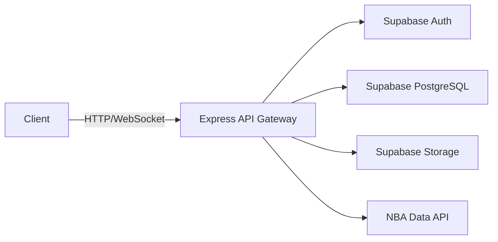
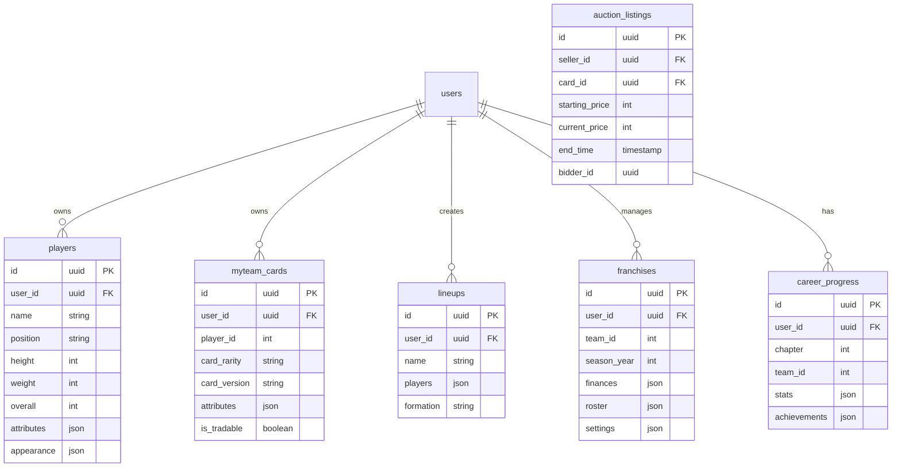

## 1. Architecture Design



## 2. Technology Description

### 2.1 Frontend Stack
- **Framework**: React@18 + TypeScript
- **Build Tool**: Vite@6
- **Styling**: TailwindCSS@3 + CSS Modules
- **State Management**: Zustand
- **Routing**: React Router DOM
- **3D Rendering**: Three.js + @react-three/fiber + @react-three/drei
- **Game Physics**: Cannon-es or custom physics engine
- **UI Icons**: Lucide React
- **Animation**: Framer Motion

### 2.2 Backend Stack
- **Auth**: Supabase Auth
- **Database**: Supabase PostgreSQL
- **Storage**: Supabase Storage
- **Real-time**: Supabase Realtime / WebSocket

### 2.3 Third-party APIs
- **NBA Data**: SportsRadar / RapidAPI NBA endpoints
- **Audio**: Web Audio API

## 3. Route Definitions

| Route | Purpose | Component |
|-------|---------|-----------|
| / | Main Menu | MainMenu |
| /career | MyCAREER Hub | CareerHub |
| /career/create | Player Creation | PlayerBuilder |
| /career/story | Story Mode | StoryMode |
| /career/city | The City | CityHub |
| /career/game | Career Gameplay | GameScene |
| /myteam | MyTEAM Hub | MyTeamHub |
| /myteam/collection | Card Collection | CardCollection |
| /myteam/lineup | Lineup Builder | LineupBuilder |
| /myteam/auctions | Auction House | AuctionHouse |
| /myteam/game | MyTEAM Gameplay | GameScene |
| /mynba | MyNBA Hub | MyNBAHub |
| /mynba/roster | Roster Management | RosterManager |
| /mynba/draft | Draft Simulator | DraftSimulator |
| /mynba/tactics | Tactics Board | TacticsBoard |
| /quickplay | Quick Play | QuickPlay |
| /quickplay/teamselect | Team Selection | TeamSelect |
| /quickplay/game | Quick Play Game | GameScene |
| /settings | Settings | Settings |
| /profile | User Profile | Profile |

## 4. API Definitions

### 4.1 Auth APIs (Supabase)
- `signUp(email, password)` - User registration
- `signIn(email, password)` - User login
- `signOut()` - User logout
- `getUser()` - Get current user

### 4.2 Game Data APIs
- `/api/players` - Get NBA players data
- `/api/teams` - Get NBA teams data
- `/api/stats` - Get player/team statistics
- `/api/draft` - Get draft classes

### 4.3 MyTEAM APIs
- `/api/cards` - Get player cards
- `/api/packs` - Open card packs
- `/api/auctions` - Auction house operations
- `/api/lineups` - Save/load lineups

### 4.4 MyCAREER APIs
- `/api/career` - Get career progress
- `/api/player` - Get player stats/attributes
- `/api/story` - Get story chapters

### 4.5 MyNBA APIs
- `/api/franchise` - Get franchise data
- `/api/trade` - Execute trades
- `/api/simulate` - Simulate games/seasons

## 5. Server Architecture Diagram



## 6. Data Model

### 6.1 Data Model Definition



### 6.2 Data Definition Language

```sql
CREATE TABLE players (
    id UUID PRIMARY KEY DEFAULT gen_random_uuid(),
    user_id UUID REFERENCES auth.users(id),
    name VARCHAR(100) NOT NULL,
    position VARCHAR(10) NOT NULL,
    height INT NOT NULL,
    weight INT NOT NULL,
    overall INT DEFAULT 60,
    attributes JSONB DEFAULT '{}',
    appearance JSONB DEFAULT '{}',
    created_at TIMESTAMP DEFAULT NOW()
);

CREATE TABLE myteam_cards (
    id UUID PRIMARY KEY DEFAULT gen_random_uuid(),
    user_id UUID REFERENCES auth.users(id),
    player_id INT NOT NULL,
    card_rarity VARCHAR(20) NOT NULL,
    card_version VARCHAR(50),
    attributes JSONB DEFAULT '{}',
    is_tradable BOOLEAN DEFAULT true,
    created_at TIMESTAMP DEFAULT NOW()
);

CREATE TABLE lineups (
    id UUID PRIMARY KEY DEFAULT gen_random_uuid(),
    user_id UUID REFERENCES auth.users(id),
    name VARCHAR(50) NOT NULL,
    players JSONB NOT NULL,
    formation VARCHAR(20),
    created_at TIMESTAMP DEFAULT NOW()
);

CREATE TABLE franchises (
    id UUID PRIMARY KEY DEFAULT gen_random_uuid(),
    user_id UUID REFERENCES auth.users(id),
    team_id INT NOT NULL,
    season_year INT NOT NULL,
    finances JSONB DEFAULT '{}',
    roster JSONB DEFAULT '{}',
    settings JSONB DEFAULT '{}',
    created_at TIMESTAMP DEFAULT NOW()
);

CREATE TABLE career_progress (
    id UUID PRIMARY KEY DEFAULT gen_random_uuid(),
    user_id UUID REFERENCES auth.users(id),
    chapter INT DEFAULT 1,
    team_id INT,
    stats JSONB DEFAULT '{}',
    achievements JSONB DEFAULT '{}',
    created_at TIMESTAMP DEFAULT NOW()
);

CREATE TABLE auction_listings (
    id UUID PRIMARY KEY DEFAULT gen_random_uuid(),
    seller_id UUID REFERENCES auth.users(id),
    card_id UUID REFERENCES myteam_cards(id),
    starting_price INT NOT NULL,
    current_price INT NOT NULL,
    end_time TIMESTAMP NOT NULL,
    bidder_id UUID REFERENCES auth.users(id),
    created_at TIMESTAMP DEFAULT NOW()
);

GRANT SELECT ON ALL TABLES TO anon;
GRANT ALL PRIVILEGES ON ALL TABLES TO authenticated;
```